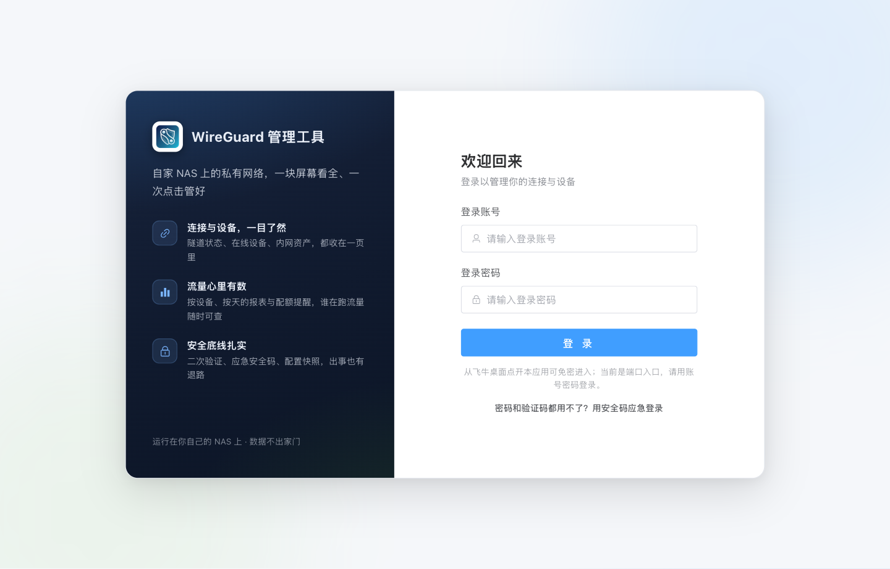
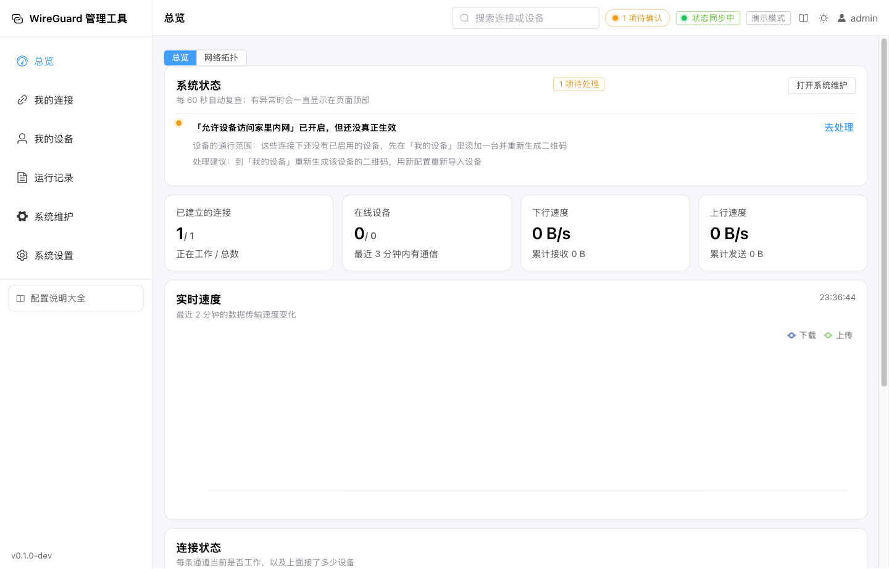
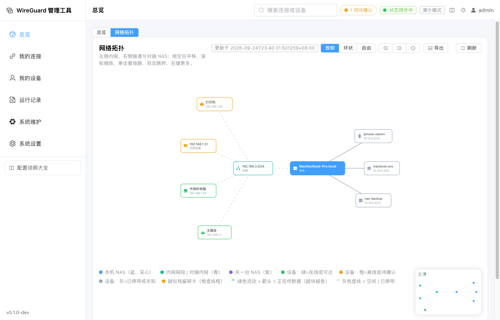
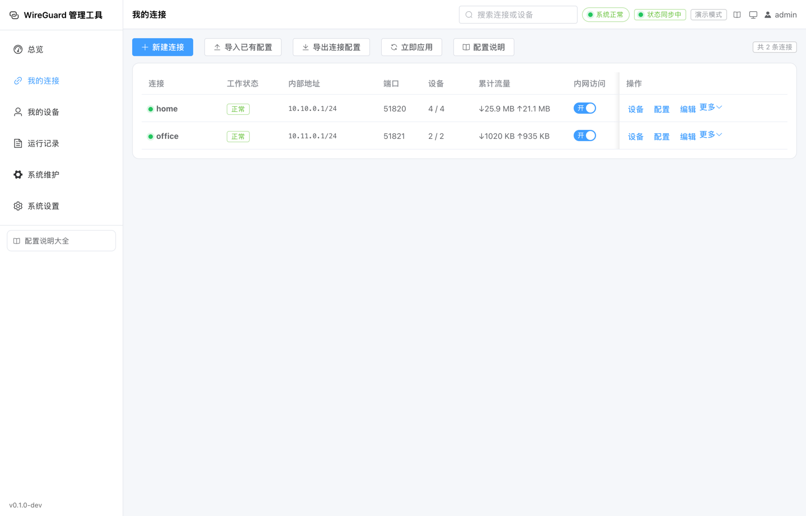
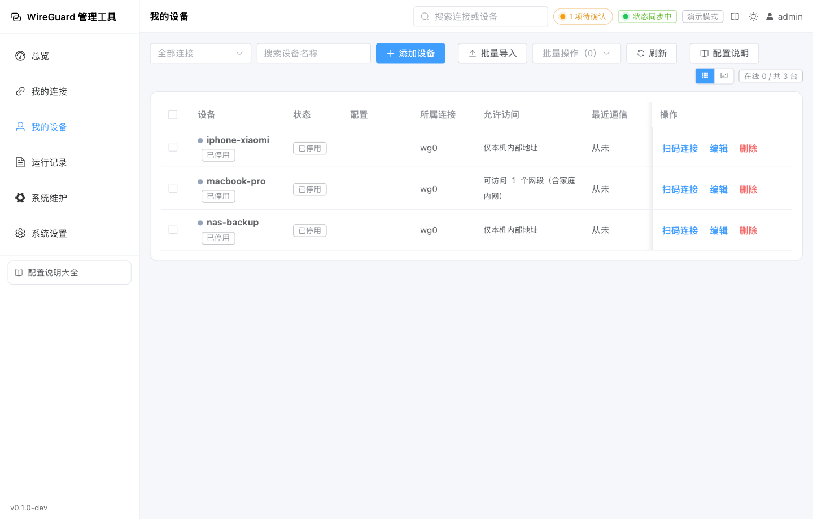
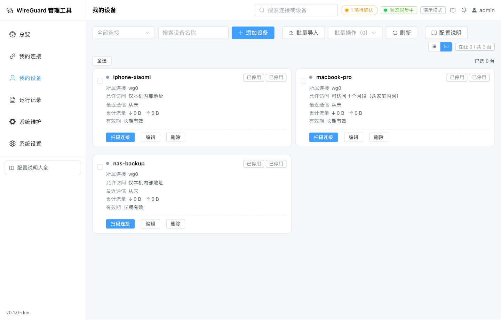
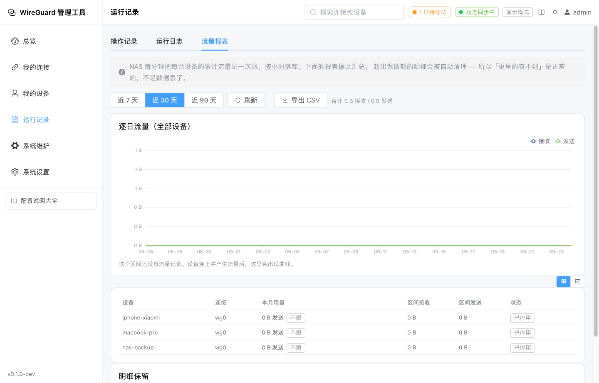
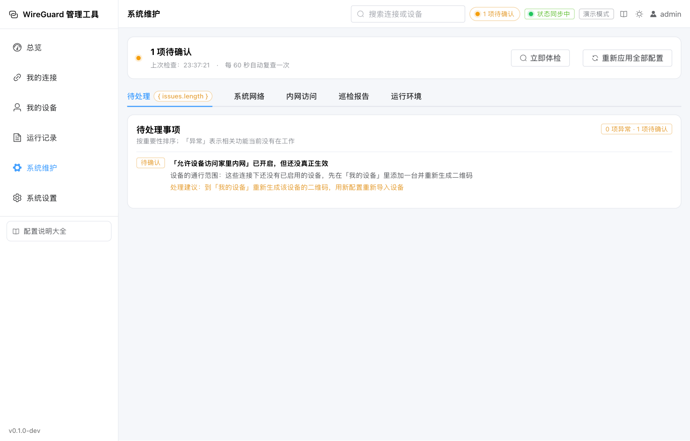
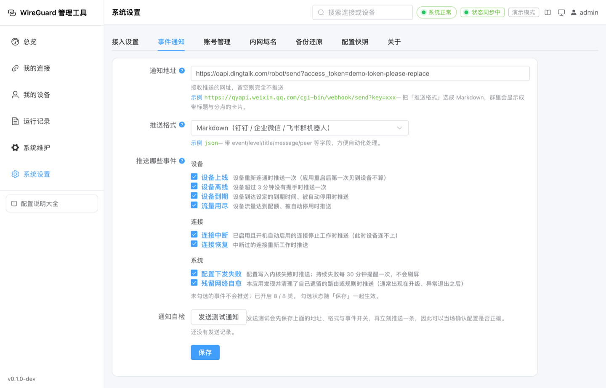
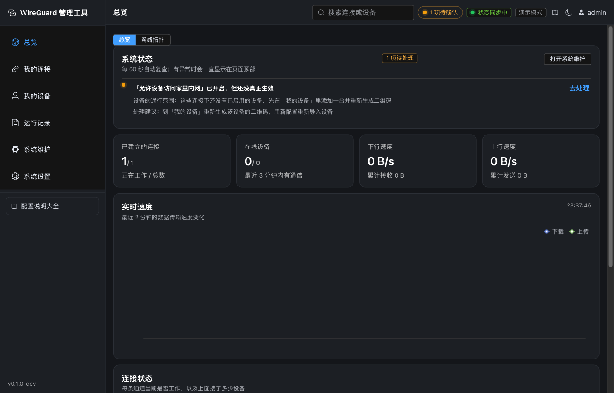

# WireGuard 管理工具

<div align="center">

**飞牛 NAS 原生的 WireGuard 可视化管理工具**（包名 `fn-wireguard`）

[](https://github.com/newcdl/fn-WireGuard/releases)
[](#license)
[](https://www.fnnas.com)

不需要记任何命令，在界面上点几下，就能让手机、电脑在外网安全地连回家，或把两处网络连成一张网。

</div>

---

## 目录

- [它能做什么](#它能做什么)
- [界面预览](#界面预览)
- [为什么安全](#为什么安全)
- [快速开始](#快速开始)
- [界面与功能](#界面与功能)
- [命令行工具](#命令行工具)
- [数据与隐私](#数据与隐私)
- [常见问题](#常见问题)
- [构建与开发](#构建与开发)
- [版本规划](#版本规划)
- [参与贡献](#参与贡献)
- [法律与免责](#法律与免责)
- [许可证](#license)

---

## 它能做什么

| 场景 | 说明 |
|---|---|
| 在外安全回家 | 手机/电脑在外使用公共 WiFi 时，加密连回 NAS，访问家中所有设备，上网流量走家里线路 |
| 只访问内网 | 只让设备访问家里内网，上网仍走本地网络，速度不受影响 |
| 用名字访问家里设备 | 设备连上后用 `nas.lan` 这类主机名访问家里机器，IP 变了也不用管 |
| 异地组网 | 把两台 NAS 或两处办公地点的内网打通：一端生成邀请、另一端导入即配对，像在同一局域网里一样互相访问 |
| 多连接隔离 | 家人、访客、不同用途各建一条连接，互不干扰 |
| 多人共用 / 访客设备 | 一条连接内禁止设备互访，别人的设备连进来后碰不到你的电脑、打印机与摄像头管理页 |
| 改坏了能退回去 | 每次改动前自动留配置快照，看清差异再一键回滚；整机配置也可导出备份 |
| 出问题第一时间知道 | 设备离线、到期、流量用尽推送到群机器人或自建推送服务 |

核心特性：

- **三步上手**：一键创建连接 → 添加设备生成二维码 → 手机扫码即连。
- **多连接互不干扰**：地址与端口按连接序号自动错开（`wg0 → 10.10.0.1/24 + 51820`，`wg1 → 10.11.0.1/24 + 51821`），手工填写时创建前即校验冲突。
- **设备访问家里内网**：连接级开关，由 NAS 对隧道网段做源地址改写，设备连上后能访问 NAS 所在局域网里的其它机器。
- **网络拓扑图**：在「总览」与「我的连接」两页以本机 NAS 为中心画一张连通图——左边是它所在的内网与内网里的设备（显示名称或 IP），右边是连上隧道的设备与经隧道连到的另一台 NAS 及其内网；鼠标停在任一节点上给出详细信息（IP、名称、连接、状态、最近通信、累计流量、这台设备能访问的内网的哪些目标）。连线按当前速率流动（箭头越快越急），一眼看出哪条线在传数据。图可以滚轮缩放、按住拖动（手机上双指缩放），每个节点按设备类型显示不同图标（NAS / 服务器、路由器、电脑、手机、打印机、电视盒子…按名字判断，认不出用默认图标），节点本身也能直接拖走并且**记住位置**；布局支持放射 / 环状 / 自由三种切换；单击一个节点会高亮整条链路，双击跳到对应页面，右键可复制地址或去相应页面处理；右上角的缩略图随时显示「你正在看哪一块」并可直接点过去；整张图可一键导出 PNG。内网设备来自 NAS 的**内核邻居表**（只读、不扫描），因此只显示最近和 NAS 通信过的机器；想让设备显示名字，到「系统设置 → 内网域名」给它登记一条即可。
- **内网资产台账**：跟着每次巡检记录内网设备（IP / MAC / 名称 / 类型、首次出现、最近出现与累计天数），把拓扑图的"当下"变成"长期"；出现从未见过的设备时写审计并推送通知（可用设置里的「新设备入网」开关关掉），确认后标为"已知"即不再提醒。
- **一键诊断包**：把体检、巡检、拓扑原始数据、资产台账、连接与设备清单、运行记录与审计打成一个 tar 下载（浏览器端打包、不上传），出问题时发一个文件即可。
- **两处内网互联（异地组网）**：在「我的连接」点「与另一台 NAS 互联」，填上对端的内网网段即可——这条连接、对端条目、隧道地址与本机暴露给对端的网段会一并建好，并给出一份邀请文件；在另一台 NAS 上导入它即完成配对。两端的隧道地址、双方公钥、准入地址与通行范围由同一份数据推导，不必两头照着填（手工填这四处、错一处都只是「不通」，最难自查）。对端没装本应用时，同一页面还能给出一份标准 wg-quick 配置直接使用。邀请文件里含对端连接的私钥，界面会提醒你走安全渠道传递。两端内网里的**普通主机**要互相访问，还需要在局域网侧把对端网段的路由指到本机（NAS 自身与连上隧道的设备不受影响），界面会把这一点写清。
- **设备之间互相隔离**：连接级开关，开启后该连接里的设备彼此不可达（其它连接的设备也碰不到它们），但都能访问 NAS 与家里内网。与「内网访问」互不影响。
- **按设备划分通行范围**：单台设备可指定能访问的网段，家里网段可直接点选；改动后设备列表标出「需重新扫码」，点一下即可重新生成。
- **按设备限制内网目标**：单台设备可单独指定「能访问家里的哪些目标」——随连接（默认）、只允许指定目标（可以细到 `192.168.1.10:445`）、或不允许访问内网。与上面那条的区别要点：通行范围写在设备那份配置里、设备可以自己改；这里的限制落在**服务端的转发规则**上，设备改不了。
- **内网域名解析**：开启后下发给设备的 DNS 指向本连接，登记的名字由本应用应答（如 `nas.lan`），其余上网域名原样转发到你配置的 DNS。
- **设备管理效率**：批量导入（粘贴一批公钥或整份配置）、全局搜索（顶栏一个入口搜连接与设备并直达详情）、分步新建向导。
- **账号安全**：应用自己的账号体系（口令以 argon2id 存储）、登录二次验证（动态口令 + 一次性恢复码 + 可信任设备 30 天）、应急安全码，以及 `fnwg-cli` 命令行后手。
- **以飞牛账号登录**：从飞牛桌面点开应用后，登录页会给出「飞牛账号 xxx」按钮，点一下即用飞牛身份进入，不必再输一遍账号密码。应用按飞牛账号的 UID 建立对应账号：用户名优先取飞牛用户名、重名自动加后缀，且**绝不复用已有账号**——一个叫 `admin` 的飞牛普通用户撞上本地管理员时，复用等于把管理员权限交出去；角色每次登录同步，飞牛侧撤权立即生效；这类账号没有本应用口令，因此永远不能走密码登录。
- **敏感操作二次验证（默认关）**：开启后，以飞牛账号登录的身份在执行敏感操作（查看本机密钥、用备份还原、管理账号）前需输入一次动态口令，验证后 10 分钟内有效；用账号密码从端口进入时不受影响——那是用户被自己开的开关挡住时的退路。开启前会先确认当前账号已绑定二次验证，没绑定不允许开启。
- **可靠与可回溯**：以数据库中的期望态为唯一事实来源，通过 netlink 幂等收敛到内核，改完配置自动下发、系统重启自动恢复；改动前自动留配置快照可一键回滚；支持整机备份导出/导入。
- **计划备份到共享文件夹**：按日程（每天 / 每周 + 时刻）把完整备份写到你授权的共享文件夹（通常放在另一块存储空间上），只保留最近若干份；目标也可以选「应用自己的备份目录」（与源数据同盘，只适合当本地轮换副本，界面会写明代价）。「立即备份」也可以顺手把这一份另存到授权目录。备份（含「立即执行一次」与「另存一份」）以及副本的下载、还原一律由后台服务以特权身份完成，界面进程不直接读写该目录——同一个目录出现两个身份，正是此前「界面说不可写、备份其实成功」那类矛盾的来源。目标目录不可用时保存会被拒绝，不会留下一个「看着是开的、其实每天失败」的开关。备份与数据库在同一块盘上会一起丢，所以目标目录不能是应用自己的数据目录；而且飞牛的应用只能访问**用户授权给它的**目录，因此目标目录是从「已授权目录」里选的、不能手填——否则只会得到「开关是开的、每天失败一次」。保存时会实际写一个探针文件验证可写，写不进去直接拒绝保存。NAS 关机错过的时间点会在开机后补一次，失败会推送通知，页面显示目标目录可用性、上次成功的时间与目录里现有的副本，并可对任一份「下载」或「用这份还原」。
- **事件通知**：设备上线/离线、到期、流量用尽、连接中断与恢复、配置下发失败、残留网络自愈共 8 类事件推送到你配置的 Webhook（钉钉、企业微信、飞书群机器人，或自建 ntfy 等），支持 JSON / 纯文本 / Markdown 三种格式与逐事件开关，可当场「发送测试通知」验证，并保留最近一次实际发出的内容用于排障。
- **流量报表**：NAS 每分钟把每台设备的累计流量记一次账（按小时落库），可在「运行记录 → 流量报表」按设备、按天查看用量与趋势（近 7 / 30 / 90 天），区间与本自然月合计一屏可见，一键导出 CSV。设备列表另有「本月用量」一列，配了每月发送额度的设备会以进度条对照。
- **每月额度**：可给单台设备设每月发送上限，用满自动停用并推送通知，月初自动恢复；自动停用的原因会写进审计与设备列表，不会出现「设备莫名其妙停了」。
- **两种列表视图**：所有列表都能在右上角切成「表格」或「卡片」——表格适合横着比字段，卡片适合一条条看。卡片在电脑上按宽度自适应分列（窗口越宽列越多），手机上仍是一条一行。选过一次就记住，下次进来还是你选的那种（手机默认卡片、电脑默认表格）。
- **全程可视化**：连接/设备/密钥/二维码/实时流量/运行记录，全字段白话说明，移动端适配。
- **内置体检**：系统状态、内网访问逐层诊断、访问控制冲突诊断、飞牛桌面入口状态、疑似残留网卡清理，异常直接告诉你「卡在哪一层、怎么处理」。
- **配置漂移巡检**：按日程（每天 / 每周 + 时刻）把实际状态和你的配置对一遍，写成一份报告：后台服务、运行模式、NAS 自身上网路线、飞牛桌面入口、连接是否在工作、内网访问与设备间隔离、访问控制是否互相矛盾、疑似残留网卡、对外访问地址、通知、域名解析、计划备份，逐项给出结论与处置办法。巡检**只读**、不做任何修改；查出「需要处理」的问题会推送一条通知，报告保留最近若干份，可回看「上一次正常是什么时候」。顶栏那份异常清单与报告同源——同一份判定，不会出现两边说法不一致。

## 界面预览

> 以下为界面预览，实际界面以你安装的版本为准。图片文件与更新方式见
> [`docs/screenshots/README.md`](docs/screenshots/README.md)。

| 登录：账号密码，或一键用飞牛账号进入 | 总览：连接与设备状态、实时流量 |
|---|---|
|  |  |

| 网络拓扑：本机、内网设备与隧道设备一张图 | 我的连接：地址端口、内网访问与设备隔离 |
|---|---|
|  |  |

| 我的设备：二维码、期限与配额 | 设备列表的卡片视图：右上角一键切换并记住 |
|---|---|
|  |  |

| 运行记录 · 流量报表：按设备与按天的用量 | 系统维护：一键体检与逐层诊断 |
|---|---|
|  |  |

| 系统设置 · 事件通知：渠道、格式与逐事件开关 | 深色外观：右上角切换浅色 / 深色 / 跟随系统 |
|---|---|
|  |  |

## 为什么安全

本应用运行在你的 NAS 上，最忌讳的是「为了组网把系统网络搞挂」。因此它从设计上就守一条铁规则：

> **绝不修改 NAS 系统的网络设置，只操作自己创建的对象，且全部可清理。**

具体保障：

| # | 承诺 | 实现方式 |
|---|---|---|
| 1 | 不接管、不删除别人的网卡 | 状态文件记录「哪些网卡是本应用创建的」，同名异主一律拒绝接管 |
| 2 | 不改系统主路由表 | 需要下发路由时写入专用策略路由表 `51888` + `ip rule`，`ip route show` 与安装前逐字符一致 |
| 3 | 默认不管理本机路由 | 「异地组网」开关默认关闭；即便开启也只对目标网段生效 |
| 4 | 内网访问与设备隔离规则都与系统隔离 | 两套规则同写在应用自己的 nftables 表 `inet fn-wireguard`，只匹配隧道网段（NAS 自身流量的源地址是局域网地址，结构上匹配不到），关闭/卸载整表删除 |
| 5 | 密钥加密落盘 | 私钥与口令用 AES-256-GCM 加密，主密钥只存本机并限定属组可读；登录口令另经 argon2id 哈希 |
| 6 | 权限收敛到最小 | 面向用户的 Web 进程以非特权用户 `fnwg` 运行；需要内核权限的操作收敛到独立的特权进程，只申请 `CAP_NET_ADMIN`、`CAP_NET_RAW` 等必要能力，并叠加 `NoNewPrivileges`、`ProtectSystem=full`、`PrivateTmp` |
| 7 | 两种访问入口权限一致 | 无论从飞牛桌面点开还是用 `IP:端口` 打开，都是同一套路由与同一套权限判定。从飞牛桌面进入时，飞牛会注入登录用户的身份（官方统一网关机制），登录页据此给出「飞牛账号 xxx」一键登录按钮，按「飞牛管理员 → 管理员、普通用户 → 只读」映射成对应的应用账号；这些身份信息**只在连接确实来自网关进程的 Unix Socket、且对端 uid 在白名单内时**才被采信，端口入口上出现的同名请求头一律先删除，所以在端口上伪造身份不可能成立。另可选开启「敏感操作二次验证」，让飞牛身份在动密钥、备份与账号前再输一次动态口令 |
| 8 | 卸载不留痕迹 | 停用/卸载时撤销全部自己创建的路由、规则、网卡；用户数据保留还是清空，由你在卸载向导里自己决定 |

> 更详细的实现说明见 [`internal/wgback/`](internal/wgback/)，核心防线都带有穷举式单元测试。

## 快速开始

### 系统要求

- 飞牛 fnOS：**amd64** 或 **arm64**（在 NAS 上执行 `uname -m` 确认：`x86_64` 用 amd64，`aarch64` 用 arm64）。
- 系统版本：要求 **fnOS ≥ 1.1.3100**。安装包已把该要求声明在 manifest 里，系统低于此版本时应用中心会直接拒绝安装 —— 桌面入口走飞牛统一网关，需要系统提供对应能力。
- 数据面：内核自带 WireGuard 模块时走标准模式；没有该模块但系统提供 TUN 设备时自动改用用户态兼容模式，功能相同、速度略逊。

### 安装

1. 在 [Releases](https://github.com/newcdl/fn-WireGuard/releases) 下载对应架构的安装包；
2. 飞牛 **应用中心 → 手动上传应用**，选择安装包安装；
3. 首次打开会让你**创建管理员账号并设置密码**，同时生成一枚应急安全码 —— 它是「密码和验证码都用不了」时的最后入口，请当场保存好（只显示这一次）。

> 从飞牛桌面点图标进入时，登录页会给出「飞牛账号 xxx」按钮，点一下即可进入（不必再输账号密码）；直接用 `IP:端口` 打开时用本应用自己的账号登录。两条入口进去之后受同一套权限约束。

### 三步连回家

1. **总览 → 一键创建推荐连接**（名称、地址、端口都自动分配）；
2. **我的设备 → 新增设备**，得到二维码；
3. 手机安装 WireGuard 官方 App，**扫一扫**即可。

> 在外网使用前，记得在路由器上把连接端口（默认 UDP `51820`）转发到 NAS 的局域网地址，并在「系统设置 → 接入设置」填写家里的公网地址。

## 界面与功能

```
总览       实时流量、连接与设备状态、系统状态卡、新手引导；页签「网络拓扑」为整网连通图
我的连接   创建/编辑/启停连接、地址端口 MTU DNS、内网访问与设备隔离开关、场景预设、导入导出、全局搜索
我的设备   设备管理、二维码、上网方式与通行范围、使用期限、本月用量与每月额度、配置过期提示、批量导入
运行记录   操作审计、系统日志、流量报表（按设备/按天用量、趋势图、导出 CSV）
系统维护   五个页签（待处理 / 系统网络 / 内网访问 / 巡检报告 / 运行环境）：一键体检、异常清单、网络修复、飞牛桌面入口、内网访问逐层诊断、访问控制配置检查、配置漂移巡检、内网资产台账、残留网卡清理、重新应用
系统设置   接入设置、事件通知、账号管理、内网域名、备份还原（手动与计划备份合成一个列表，可搜索/筛选/刷新）、配置快照、关于
（各列表右上角均可在「表格 / 卡片」两种视图间切换，选择会被记住）
```

> 「事件通知」与「内网域名」都是独立页签，与「接入设置」各自保存：改通知渠道不会连带改动对外访问地址这类会影响所有设备的配置。

- **配置快照与一键回滚**：每次改动连接、设备、内网域名或系统设置前会自动留一份配置快照，改坏了可在「系统设置 → 配置快照」里看清「回滚会撤销什么」再一键退回。快照不含账号密码、不做安全回退，回滚前还会为当前状态再留一份，滚错了能再滚回来。
- **备份还原**：可导出整机配置（可选是否包含密钥），也可在换机、重装、手滑之后整份导回。
- **两种进入方式，一套权限**：用 `IP:端口` 访问时，用「系统设置 → 账号管理」里的账号密码登录；从**飞牛桌面**点开时，飞牛会先校验你的飞牛账号并把登录身份注入转发请求（官方统一网关机制），登录页据此给出「飞牛账号 xxx」按钮，点一下即按「飞牛管理员 → 管理员、普通用户 → 只读」映射成对应账号进入。应用按飞牛账号的 UID 建号（用户名优先取飞牛用户名、重名加后缀，不复用已有账号），角色随每次登录同步；这类账号没有本应用口令，不能走密码登录。这些身份信息**只在连接确实来自网关进程的 Unix Socket、且对端 uid 在白名单内时**才被采信，而且端口入口上出现的同名请求头会被直接删掉——所以「在端口上伪造自己是管理员」不可能成立。两条入口进去之后受同一套权限约束；忘记密码可用安全码应急登录，管理员也可用 `fnwg-cli` 重置。真机上若「点开没能按飞牛身份进入」，可用只读的诊断接口 `GET /auth/gateway-probe`（仅管理员）看通道类型、对端 uid 与观察到的身份头，不必去翻日志。
- **敏感操作二次验证**：在「系统设置 → 账号管理」开启（默认关）。开启后，以飞牛账号登录的身份在看本机密钥、用备份还原、管理账号前需输入一次动态口令，验证后 10 分钟内有效；端口 + 账号密码通道不受影响，它是用户被自己开的开关挡住时的退路。开启前会先要求当前账号已绑定二次验证。
- **登录二次验证与应急安全码**：可给账号开启动态口令（配一次性恢复码、可信任设备 30 天）；应急安全码用后即废并下发新码，登录页可凭它应急进入并顺手重设密码。
- **标准模式与兼容模式**：内核自带加密网络模块时走标准模式；系统没有这个模块时自动改用用户态实现（兼容模式），功能相同、速度与资源占用略逊。关于页的「工作模式」显示当前用的是哪一种。
- **浅色 / 深色 / 跟随系统**：右上角可切换外观，选择记在浏览器本地（换设备、换浏览器各选各的，不影响别人），刷新与重开都保持；首次打开跟随系统，也就跟着 fnOS 桌面的深浅色。
- **系统状态栏**：顶栏常驻红/黄/绿状态点，异常时点击直达「系统维护」。
- **异常横幅**：只要存在「功能确实没在工作」的问题（后台服务没运行、连接没起来、飞牛桌面入口失效等），页面顶部会常驻横幅，可一键修复或跳转处理。
- **配置说明大全**：每个配置项都有「是什么 / 为什么 / 有什么影响 / 例子」的白话说明，「关于」页另有「安全与可靠性机制」一组，讲清二次验证、安全码、快照回滚、兼容模式这些没有输入框的能力。
- **配置过期提示**：改了对外地址、DNS、通行范围或内网域名开关后，设备列表会标出「需重新扫码」——设备里那份配置不会自己更新。

## 命令行工具

安装后 `fnwg-cli` 软链到 `/usr/local/bin/fnwg-cli`：

```bash
sudo /usr/local/bin/fnwg-cli status                  # 连接与设备实时状态
sudo /usr/local/bin/fnwg-cli netcheck                # 系统上网路线 + 内网访问链路逐层自检 + 疑似残留网卡
sudo /usr/local/bin/fnwg-cli reconcile               # 立即把配置下发到内核
sudo /usr/local/bin/fnwg-cli export --all --out DIR  # 导出全部连接的 wg-quick 配置
sudo /usr/local/bin/fnwg-cli cleanup                 # 删除本应用创建的全部网络对象
sudo /usr/local/bin/fnwg-cli cleanup-foreign <名称>  # 清理不是本应用创建的 WireGuard 网卡
sudo /usr/local/bin/fnwg-cli version                 # 版本信息
```

界面进不去时的后手（同样需要 `sudo`）：

```bash
sudo /usr/local/bin/fnwg-cli user list                        # 列出账号与二次验证状态
sudo /usr/local/bin/fnwg-cli user reset-password <账号>       # 重置密码（不指定新密码则随机生成并显示一次）
sudo /usr/local/bin/fnwg-cli user reset-2fa <账号>            # 关闭二次验证（手机与恢复码都丢了时用）
sudo /usr/local/bin/fnwg-cli security-code                    # 重新生成应急安全码（旧码立即作废）
```

> `sudo` 按自己的 `secure_path` 查找命令，若报 `command not found`，用绝对路径即可。
> 上述后手命令都会以 `fnwg-cli` 的身份写进审计日志。

## 数据与隐私

- 全部配置、密钥、日志均保存在 NAS 本机（`@appdata/fn-wireguard`），不联网上传。
- 私钥与口令落盘前用 AES-256-GCM 加密；登录口令用 argon2id 哈希；应急安全码只存哈希，明文只在生成那一刻出现过。
- 不采集、不外传任何个人数据，也没有任何遥测；只有你主动配置告警 Webhook 时才向指定地址发送通知。
- 卸载时由你决定保留还是删除数据；两种选择都会清理本应用创建的内核对象。
- 开源许可：GPL-3.0-only，许可全文与第三方组件清单可在应用内「系统设置 → 关于 → 开源许可」查看，也可直接下载。

## 常见问题

### Q1. 装完 NAS 上不了网（FN Connect 失效、应用市场打不开）

这通常是**旧版本（≤ 0.2.0）**的残留路由所致，0.3.0 起已从代码层禁止此类行为。先看现象：

```bash
ip route show default                 # 是否多了 default dev wg0
sudo /usr/local/bin/fnwg-cli cleanup  # 删除本应用创建的全部对象
```

系统原本的默认路由并没有被删除，无需手工加回。

### Q2. 从飞牛桌面点图标，打开是 502 / Bad Gateway

502 的含义很具体：**飞牛的网关连不上本应用的入口**（应用目录下的 `app.sock` 文件）。它和「服务没起来」不是一回事 —— 这种情况下 `IP:端口` 通常**仍然能正常打开**。

```bash
curl -s -o /dev/null -w '%{http_code}\n' http://<NAS地址>:34567/          # 端口入口是否正常
ls -l /vol*/@appcenter/fn-wireguard/app.sock                             # 入口 socket 在不在
journalctl -u fnwg-web -n 40 --no-pager | grep -E "网关入口|Web 服务已启动"  # 应用自己怎么说
```

三种结果对应三种处理：

- **`app.sock` 不存在**：入口没建起来。应用每 15 秒自检一次并会**自动重建**（日志里会留下「曾失效，已就地重建」），通常几十秒内自行恢复；长时间不恢复时，到 **系统维护 → 系统网络 → 飞牛桌面入口** 看它给出的原因与处置办法。
- **`app.sock` 在，但日志里有「网关入口不可用」**：安装/升级收尾时就会被明确报出来，按日志里的原因处理（常见的是应用目录权限被改动）。
- **`app.sock` 在、日志也正常，点图标仍是 502**：问题在飞牛网关那一侧（例如它仍指向旧入口）。到应用中心**停用再启用**本应用让它重新注册即可；仍不行请带上上面三条命令的输出提 Issue。

> 桌面图标不好用不影响任何功能：用 `IP:端口` 进去是同一套账号与权限。

### Q3. 设备连上了，能访问 NAS，但访问不了家里其它设备

先看「我的连接」里该连接的**「访问家里内网」**开关是否打开；若已打开仍不通，到 **系统维护 → 内网访问**，会逐项告诉你卡在哪一层（开关 / 设备通行范围 / 转发规则 / 内核转发 / 系统转发链 / 出口网卡）。

同一个页面下方的 **访问控制配置检查** 还会指出「设置之间互相矛盾」的情况，例如：设备的通行范围里有家里网段，但这条连接的内网访问开关其实是关的。

### Q4. 系统里有两个 wg0 / wg1 网卡不能用，还占着端口

它们是**历史残留**（不是当前应用创建的），应用出于安全拒绝接管。到 **系统维护 → 运行环境 → 疑似残留网卡** 清理（会要求输入网卡名二次确认，且只允许删除 WireGuard 类型的网卡）。

### Q5. 内网访问提示「未能探测到出口网卡」

说明 NAS 的默认路由没能被识别。到 **系统维护** 查看「出口网卡」一项的具体原因：没有默认路由 / 出口指向隧道 / 网卡未启用，按提示处理即可。

### Q6. 开了「设备之间互相隔离」，但设备之间还是能互访

到 **系统维护 → 内网访问诊断**，看 **「设备间隔离」** 这一项的结论：

- 「开关已打开，但隔离规则未生效」时会写明原因（例如隧道地址是 IPv6 网段）；
- 本应用每 10 秒自动重试一次，也可以点「立即应用」马上重试。

另外注意隔离的边界：它只断**设备之间**的流量，设备访问 NAS 与家里内网不受影响。

### Q7. 设备列表上显示「需重新扫码」是什么意思

设备是照着你当时给的配置连的，而**改动只影响之后新生成的配置**。以下改动都会让已经连上的设备继续使用旧设置：

- 系统设置里的「对外访问地址」；
- 连接的 DNS、MTU；
- 「系统设置 → 内网域名」的解析开关（它会改写下发设备的 DNS）；
- 单台设备的「上网方式」与「通行范围」。

点一下那个标签（或该行的「扫码连接」）重新生成二维码，用新配置重新导入设备即可；生成后标记会立刻消失。只改设备名、备注、配额、期限**不会**触发这个提示，**也不需要删除设备**。

### Q8. 顶栏说「正在使用兼容模式」，需要处理吗

不需要。系统内核没有可用的加密网络模块时，应用会自动改用用户态实现：连接照常建立、功能完全相同，只是速度与资源占用略逊于标准模式；系统以后支持了内核模块会自动切回。

真正要处理的是另一种提示 ——「系统未开启标准加速模式」（内核模块与 TUN 设备都不可用），那意味着新建的连接无法工作，先把 NAS 系统更新到较新版本；若更新后仍不支持，请把系统版本与内核版本（`uname -r`）反馈给我们以便适配。

### Q9. 开了「内网域名解析」，设备还是用不了主机名

按顺序确认三件事：

1. **开关是开着的**，且「系统设置 → 内网域名」里确实登记了记录（`nas.lan → 10.10.0.10` 这样一条）；
2. **至少有一条连接处于启用且工作状态** —— 解析服务只在有可用隧道时监听，没有可用连接时它会自动停掉；
3. **设备用的配置是开启之后生成的** —— 这个开关会改写下发给设备的 DNS，改动前扫码的设备仍用旧 DNS，需要重新扫码（见 Q7）。

都确认过仍不行，到 **系统维护 → 一键体检** 看「内网域名」这一项给出的结论。

### Q10. 配了通知地址，但一直没收到消息

到 **系统设置 → 事件通知**：

1. 点 **「发送测试通知」** —— 它会先保存当前填写的内容（地址、格式、事件开关）再立刻推送一条，因此可以当场确认配置是否正确；
2. 看下方的 **「最近一次」** 记录：成功会显示返回的 HTTP 状态码；失败会显示具体原因，例如 `401`、`dial tcp ... connection refused`，或群机器人的业务错误码（`接收端返回错误码 93000：invalid webhook url`）；
3. 展开 **「查看实际发出的内容」** 可以直接看到发过去的报文 —— 群机器人不显示消息时，这是唯一可靠的线索（标题被截断？关键词不匹配？字段名不对？）；
4. 确认对应的事件类型是**勾选**状态：设备很多时「上线」会很频繁，可以只留「离线 / 到期 / 流量用尽 / 连接中断 / 配置下发失败」。

> 推送格式怎么选：钉钉 / 企业微信 / 飞书群机器人选 **Markdown**（钉钉与企业微信显示为带标题与分点的卡片，飞书发交互式卡片、异常红色头部正常绿色头部）；自建 ntfy、Bark 等只认纯文本的接收端选 **纯文本**；给脚本或自动化平台用选 **JSON**。
> Markdown 会按地址自动判断接收端（`oapi.dingtalk.com` / `qyapi.weixin.qq.com` / `open.feishu.cn`，含飞书国际版 `open.larksuite.com`）；用了反代等自定义域名时无法判断，界面会当场提示改用 JSON 或纯文本 —— 不会猜。
> 钉钉与飞书机器人若开了「自定义关键词」等安全设置，消息里必须包含关键词，否则接收端会返回错误码（会显示在「最近一次」里）。
> 同一对象的同类事件在静默窗口内只推一次（默认 5 分钟，配置下发失败为 30 分钟），避免网络抖动时连发几十条。

### Q11. 流量报表里没有数据，或者只有最近一段时间

按顺序看三件事：

1. **明细从「开始记账」之后才有** —— 它不是从设备一装上就有的：升级到带流量记账的版本之后才逐小时累积，更早的时段查不到是正常的。
2. **保留期到期会清理** —— 默认保留 90 天，见报表页底部的「明细保留」（管理员可改）。调短会立即清掉更早的明细，调长只影响以后。
3. **某一天是空的** —— 那天确实没有流量，或者 NAS 当时没在运行（关机、应用被停用）：那段时间没有采样，自然也没有账。

> 报表数字与实时曲线对不上是正常的：曲线是网卡瞬时速率的快照，报表是逐小时累计的增量。报表的「合计」与设备列表的「累计流量」口径也不同 —— 后者是本次网卡启用以来的累计值，重启连接会重新计数，报表不会。

### Q12. 界面进不去了（忘记密码、换了手机、或验证码用不了）

按「最省事 → 最彻底」的顺序试：

1. **用安全码应急登录**：登录页点「密码和验证码都用不了？用安全码应急登录」。它一直可用，只能使用一次，用完即作废并下发新的一码；登录时还可以顺手重设管理员密码、关掉二次验证。
2. **用命令行后手**：`sudo /usr/local/bin/fnwg-cli user reset-password <账号>` 或 `user reset-2fa`，同样能解开锁死的账号。两者都以 `fnwg-cli` 身份写进审计日志。
3. 以上都不行时，在飞牛 **应用中心 → WireGuard 管理工具 → 停用再启用**，或执行
   `sudo /usr/local/bin/fnwg-cli status` 确认服务状态；账号数据在停用时保留，卸载时由你在卸载向导里选择保留或删除。

> 安全码与命令行工具是刻意保留的两条独立退路：它们不依赖登录、也不依赖任何外部系统。系统只保存安全码的哈希，明文只在生成那一刻出现过，我们也无法帮你找回。

### Q13. 卸载会丢配置吗？

卸载时飞牛会弹出选项，由你自己决定：

- **保留数据（默认）**：连接、设备、账号、二次验证、安全码与备份都留在 NAS 上，重新安装后自动恢复；内核对象（网卡、策略路由、nftables 规则）照常清理，不给系统留痕迹。
- **删除全部数据**：数据库、主密钥、安全码与历史备份一并清空，卸载后无法找回——建议先在「系统设置 → 备份还原」导出备份再卸载。

若卸载向导未弹出（例如命令行卸载或卸载中途异常），一律按「保留数据」处理，不会替你删掉数据。

### Q14. `sudo fnwg-cli netcheck` 提示 `command not found`

不是没装，是 `sudo` 的查找路径和你的 shell 不一样，用绝对路径 `/usr/local/bin/fnwg-cli` 即可。

## 构建与开发

环境：Go 1.24、Node 20、[fnpack](https://developer.fnnas.com/docs/cli/fnpack)。

```bash
./scripts/version.sh show                  # 查看当前版本
./scripts/version.sh patch "改动说明"      # 升补丁版本
make release MSG="改动说明"                # 升版本 + 打双架构包
./scripts/build.sh all                     # 打双架构安装包
make dev                                   # 本地开发服务（内存后端，不碰真实网络）
```

- 版本号唯一来源：`apps/fn-wireguard/manifest` 的 `version`；`version.sh` 会把它同步到前端工程（`package.json` 与锁文件）。README 里不写版本号——badge 直接取自 GitHub Releases，写死必然会过期。
- 干净克隆即可 `go build ./...` / `go test ./...`（前端产物用构建标签 `embedui` 控制，发布构建自动内嵌）。
- 打 tag 推送到 GitHub 后，Actions 自动校验「tag 与 manifest 版本一致」、跑格式/静态检查/测试、双架构打包并创建 Release。

```bash
git tag -a v0.9.0 -m "fn-WireGuard v0.9.0"
git push origin v0.9.0
```

- 新增源文件必须带 SPDX 头部（`SPDX-License-Identifier: GPL-3.0-only` 与版权行）；改动依赖后要重新生成 [THIRD_PARTY_LICENSES.md](THIRD_PARTY_LICENSES.md)，否则安装包里那份清单会与实际依赖不符。

## 版本规划

详见 [docs/ROADMAP.md](docs/ROADMAP.md)。

**已发布**（GitHub Releases 可下载）：

- **0.3.x** 安全加固、多连接、异地组网
- **0.4.0** 稳定性与残留治理
- **0.5.x** 内网访问（设备访问家里其它设备）
- **0.6.x** 界面整合与状态可见性
- **0.7.0** 访问控制（设备间隔离、按设备通行范围）与事件通知（Webhook 真正生效）
- **0.7.1** 事件通知收尾：独立页签、Markdown 推送（钉钉 / 企业微信）、8 类可配置事件、实际发出的内容可查看
- **0.8.1** 内网域名解析、设备批量导入与全局搜索、备份导出/导入与全量还原
- **0.9.0** 账号安全与兼容性：
  - 登录二次验证：动态口令（自实现 RFC 6238）+ 一次性恢复码 + 可信任设备 30 天
  - 应急安全码与 `fnwg-cli` 命令行后手：忘记密码、手机丢失时的两条独立退路
  - 配置快照与一键回滚：改动前自动留档、可查看与当前配置的差异、回滚前再留一份
  - 用户态兼容模式：内核缺少 WireGuard 模块时自动降级，连接照常可用
  - 飞牛桌面入口接入统一网关，并补上运行期自愈与体检项；两条入口（桌面图标 / `IP:端口`）同一套账号、同一套权限
  - 界面支持浅色 / 深色 / 跟随系统；事件通知新增飞书推送（含国际版 `open.larksuite.com`）
  - 许可迁移到 GPL-3.0-only，并随包分发许可全文与第三方清单

**1.0.0** —— 自 0.9.0 以来的全部内容：

- **网络拓扑图**：以本机 NAS 为中心画出所在内网及其设备、连上隧道的设备、经隧道连到的另一台 NAS 及其内网；节点可拖动并记住位置，放射 / 环状 / 自由三种布局，单击高亮链路、双击跳转、右键菜单、全览缩略图与导出 PNG，连线按实时速率流动
- **按设备限制内网目标**：可限定单台设备能访问家里的哪些目标（细到 `192.168.1.10:445`），限制落在服务端转发规则上，设备改不了
- **内网资产台账**：跟着每次巡检记录内网设备（地址 / MAC / 名称 / 类型 / 首次与最近出现 / 累计天数），新设备入网即写审计并推送通知
- **配置漂移巡检**：按日程把实际状态与配置对一遍写成报告，逐项给结论与处置办法，只读不修改
- **一键诊断包**：体检 / 巡检 / 拓扑原始数据 / 资产台账 / 连接与设备 / 运行记录 / 审计打成 tar 下载（浏览器端打包、不上传）
- **流量报表与每月额度**：每分钟记账（按小时落库），按设备 / 按天查看用量与趋势（近 7 / 30 / 90 天）、导出 CSV；每月发送额度用满自动停用并通知、月初自动恢复
- **计划备份到授权共享文件夹**：按日程写入、保留份数、目录可写性探测、错过补跑、失败通知，可从副本下载或还原
- **两种列表视图**：所有列表可在右上角切换表格 / 卡片（宽屏卡片自适应分列），选择被记住
- **以飞牛账号登录**：从飞牛桌面点开可用飞牛账号一键进入（按 UID 建号、角色随登录同步、不复用已有账号）；另加**默认关**的「敏感操作二次验证」，让飞牛身份在动密钥、备份与账号前再输一次动态口令
- **初始化更省事**：可以选择不建本地账号、直接用飞牛账号登录（本地不落任何口令），应急安全码照发；初始化页与登录页一并重做，桌面与手机各自适配
- **二维码观感**：统一改为圆点样式并带应用图标，扫码实测通过
- 缺陷修复：未配置对外地址时「需重新扫码」误报且点不掉、首次打开「开启二次验证」时二维码区域空白、列表操作列「更多」下拉比旁边按钮偏高

**后续版本**：见 [docs/ROADMAP.md](docs/ROADMAP.md)。

## 法律与免责

本应用是一个通用的网络配置管理工具，请只在**你拥有合法使用权的设备与网络**上使用。

**严禁将其用于任何违法用途**——包括但不限于：未经授权访问、控制、干扰或探测他人的网络与设备；绕过网络管理、审计或计费；侵犯他人隐私、通信秘密、个人信息或知识产权；传播违法信息；以及其他违反所在地法律法规的行为。

**使用者须对使用本应用的全部行为及其后果自行承担全部责任。** 作者不参与、无法知悉也无法控制使用者的具体用途与部署环境，因此**不对使用者的任何行为承担连带责任或任何形式的责任**。

本应用按「现状」提供，不附带任何明示或默示的担保；在适用法律允许的最大范围内，作者与贡献者不对因使用或无法使用本应用而产生的任何直接、间接、附带、特殊或后果性损失（包括但不限于数据丢失、业务中断、利润损失、设备或网络损坏）承担责任。

> 完整的《用户协议与隐私说明》随安装包分发（设备上应用目录下的 `LICENSE` 文件），也可在应用内「系统设置 → 关于 → 法律与免责声明」查看。
> 若不同意其中任何内容，请停止使用并卸载本应用。

## 参与贡献

欢迎提交 Issue 与 Pull Request。

- 提交 Issue 前请附上：fnOS 版本、`uname -m`、`sudo /usr/local/bin/fnwg-cli netcheck` 输出、相关日志。
- 涉及网络行为的改动，请务必补充 `internal/wgback/routesafety_test.go` 与 `internal/wgback/natplan_test.go` 中的回归用例。
- 修改配置项文案只需编辑 `frontend/src/constants/fields.ts`，界面会自动同步。
- 新增源文件请带上 SPDX 头部（见[构建与开发](#构建与开发)）；改了依赖要同步第三方许可清单。

### 提交前自检

```bash
test -z "$(gofmt -l .)" && go vet ./... && go test ./...
cd frontend && npx vue-tsc --noEmit && npm run build
```

## License

[GPL-3.0-only](LICENSE) © 小柿子 &lt;newxsz@163.com&gt; · 源码：[github.com/newcdl/fn-WireGuard](https://github.com/newcdl/fn-WireGuard)

本程序是自由软件：你可以按自由软件基金会发布的 GNU 通用公共许可证第 3 版
（且仅限该版本）的条款重新分发和/或修改它。本程序按「现状」分发，不提供任何担保。

- 许可全文：[LICENSE](LICENSE)（安装包内为 `apps/fn-wireguard/COPYING`，界面「系统设置 → 关于 → 开源许可」也可查看）
- 版权与许可声明：[NOTICE](NOTICE)
- 第三方组件与各组件许可全文：[THIRD_PARTY_LICENSES.md](THIRD_PARTY_LICENSES.md)

为什么是 GPL-3.0 而不是 GPL-2.0：依赖中包含 Apache-2.0 组件（nftables、netlink、echarts），
该许可证与 GPL-2.0 不兼容，但与 GPL-3.0 兼容。
